# Agent-Friendly 人才库系统架构图

> 版本：v2.3
> 更新日期：2024-02
> 说明：所有图表使用 Mermaid 语法，支持按需走层的灵活路由
> 关联文档：[agent-talent-search-design.md](./agent-talent-search-design.md)

---

## 一、系统分层架构

### 1.1 整体架构分层

系统采用分层架构，但**不强制所有请求走完整路径**。根据操作复杂度，请求可以选择最短有效路径。

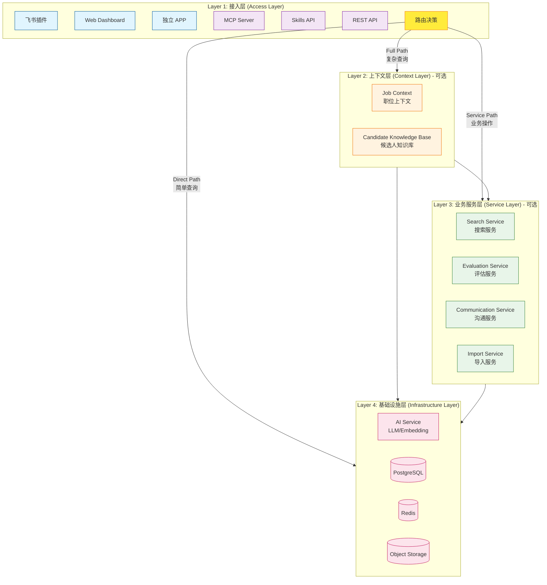
```mermaid
flowchart TB
    subgraph L1["Layer 1: 接入层 (Access Layer)"]
        direction LR
        H1[飞书插件]
        H2[Web Dashboard]
        H3[独立 APP]
        A1[MCP Server]
        A2[Skills API]
        A3[REST API]
        Router[路由决策]
    end

    subgraph L2["Layer 2: 上下文层 (Context Layer) - 可选"]
        direction LR
        JC[Job Context<br/>职位上下文]
        CKB[Candidate Knowledge Base<br/>候选人知识库]
    end

    subgraph L3["Layer 3: 业务服务层 (Service Layer) - 可选"]
        direction LR
        SS[Search Service<br/>搜索服务]
        ES[Evaluation Service<br/>评估服务]
        CS[Communication Service<br/>沟通服务]
        IS[Import Service<br/>导入服务]
    end

    subgraph L4["Layer 4: 基础设施层 (Infrastructure Layer)"]
        direction LR
        AI[AI Service<br/>LLM/Embedding]
        DB[(PostgreSQL)]
        CACHE[(Redis)]
        STORAGE[(Object Storage)]
    end

    %% 路由决策
    Router -->|"Full Path<br/>复杂查询"| L2
    Router -->|"Service Path<br/>业务操作"| L3
    Router -->|"Direct Path<br/>简单查询"| L4

    %% 层间依赖
    L2 --> L3
    L2 --> L4
    L3 --> L4

    %% 样式
    classDef humanAccess fill:#e1f5fe,stroke:#01579b
    classDef agentAccess fill:#f3e5f5,stroke:#7b1fa2
    classDef context fill:#fff3e0,stroke:#ef6c00
    classDef service fill:#e8f5e9,stroke:#2e7d32
    classDef infra fill:#fce4ec,stroke:#c2185b
    classDef router fill:#ffeb3b,stroke:#f57f17

    class H1,H2,H3 humanAccess
    class A1,A2,A3 agentAccess
    class JC,CKB context
    class SS,ES,CS,IS service
    class AI,DB,CACHE,STORAGE infra
    class Router router
```

### 1.2 层级职责定义

| 层级 | 名称 | 职责 | 何时需要 | 可跳过场景 |
|------|------|------|----------|-----------|
| L1 | 接入层 | 协议转换、认证、路由 | 始终需要 | 不可跳过 |
| L2 | 上下文层 | 语义理解、意图解析、上下文管理 | 自然语言查询、多轮对话 | 简单关键词搜索、精确查询 |
| L3 | 业务服务层 | 业务逻辑、权限校验、结果组装 | 复杂业务操作 | 简单数据读取 |
| L4 | 基础设施层 | 数据存储、AI 能力 | 始终需要 | 不可跳过 |

---

## 二、上下文层详细架构

### 2.1 双上下文模型

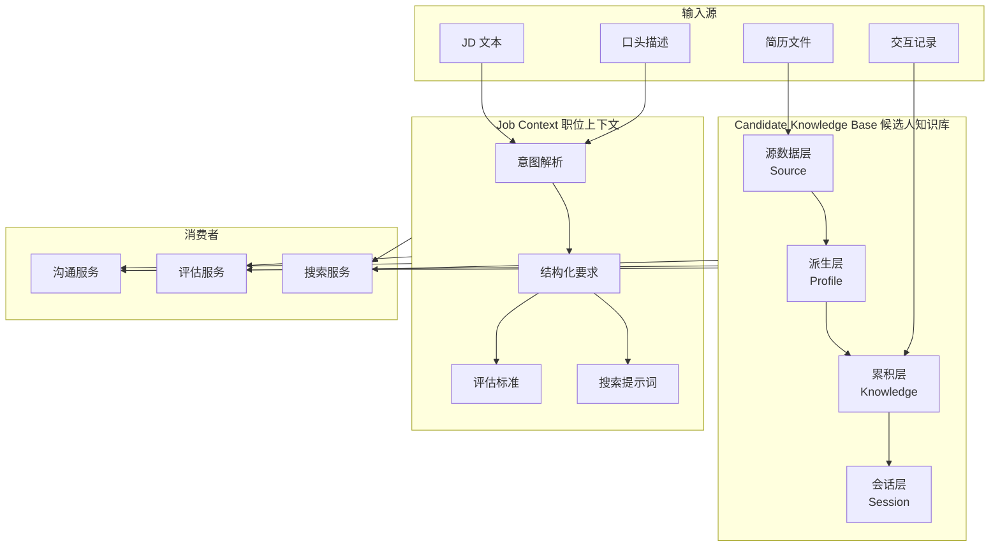
```mermaid
flowchart TB
    subgraph Input["输入源"]
        JD[JD 文本]
        VD[口头描述]
        Resume[简历文件]
        Interaction[交互记录]
    end

    subgraph JobContext["Job Context 职位上下文"]
        JC_Parse[意图解析]
        JC_Struct[结构化要求]
        JC_Hints[搜索提示词]
        JC_Criteria[评估标准]

        JC_Parse --> JC_Struct
        JC_Struct --> JC_Hints
        JC_Struct --> JC_Criteria
    end

    subgraph CKB["Candidate Knowledge Base 候选人知识库"]
        CKB_L1[源数据层<br/>Source]
        CKB_L2[派生层<br/>Profile]
        CKB_L3[累积层<br/>Knowledge]
        CKB_L4[会话层<br/>Session]

        CKB_L1 --> CKB_L2
        CKB_L2 --> CKB_L3
        CKB_L3 --> CKB_L4
    end

    subgraph Consumers["消费者"]
        Search[搜索服务]
        Eval[评估服务]
        Comm[沟通服务]
    end

    JD --> JC_Parse
    VD --> JC_Parse
    Resume --> CKB_L1
    Interaction --> CKB_L3

    JobContext --> Search
    JobContext --> Eval
    JobContext --> Comm
    CKB --> Search
    CKB --> Eval
    CKB --> Comm
```

### 2.2 候选人知识库四层架构

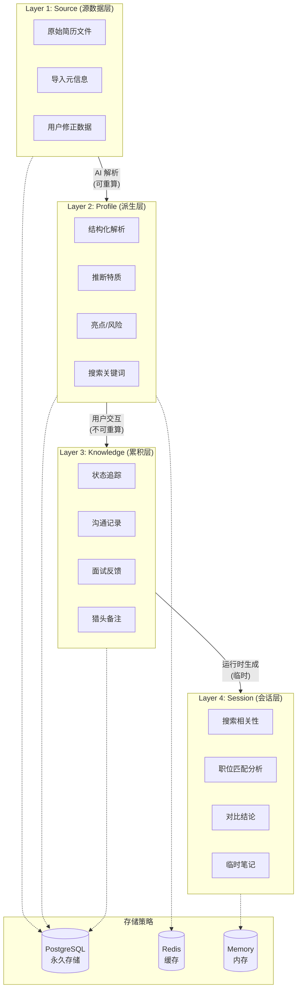
```mermaid
flowchart TB
    subgraph Layer1["Layer 1: Source (源数据层)"]
        S1[原始简历文件]
        S2[导入元信息]
        S3[用户修正数据]
    end

    subgraph Layer2["Layer 2: Profile (派生层)"]
        P1[结构化解析]
        P2[推断特质]
        P3[亮点/风险]
        P4[搜索关键词]
    end

    subgraph Layer3["Layer 3: Knowledge (累积层)"]
        K1[状态追踪]
        K2[沟通记录]
        K3[面试反馈]
        K4[猎头备注]
    end

    subgraph Layer4["Layer 4: Session (会话层)"]
        C1[搜索相关性]
        C2[职位匹配分析]
        C3[对比结论]
        C4[临时笔记]
    end

    Layer1 -->|"AI 解析<br/>(可重算)"| Layer2
    Layer2 -->|"用户交互<br/>(不可重算)"| Layer3
    Layer3 -->|"运行时生成<br/>(临时)"| Layer4

    subgraph Storage["存储策略"]
        DB1[(PostgreSQL<br/>永久存储)]
        DB2[(Redis<br/>缓存)]
        DB3[(Memory<br/>内存)]
    end

    Layer1 -.-> DB1
    Layer2 -.-> DB1
    Layer2 -.-> DB2
    Layer3 -.-> DB1
    Layer4 -.-> DB3
```

### 2.3 上下文层数据生命周期

| 数据类型 | 创建时机 | 更新时机 | 销毁时机 | 可重算 |
|----------|----------|----------|----------|--------|
| Job Context | 用户输入 JD/描述 | 用户修正 | 搜索结束 | ✅ |
| CKB.Source | 简历导入 | 用户手动修改 | 候选人删除 | ❌ |
| CKB.Profile | 导入后自动生成 | AI 模型升级 | Source 删除 | ✅ |
| CKB.Knowledge | 首次交互 | 每次交互追加 | 永不销毁 | ❌ |
| CKB.Session | 搜索开始 | 搜索过程中 | 会话超时 | 不适用 |

---

## 三、业务服务层架构

### 3.1 服务依赖关系

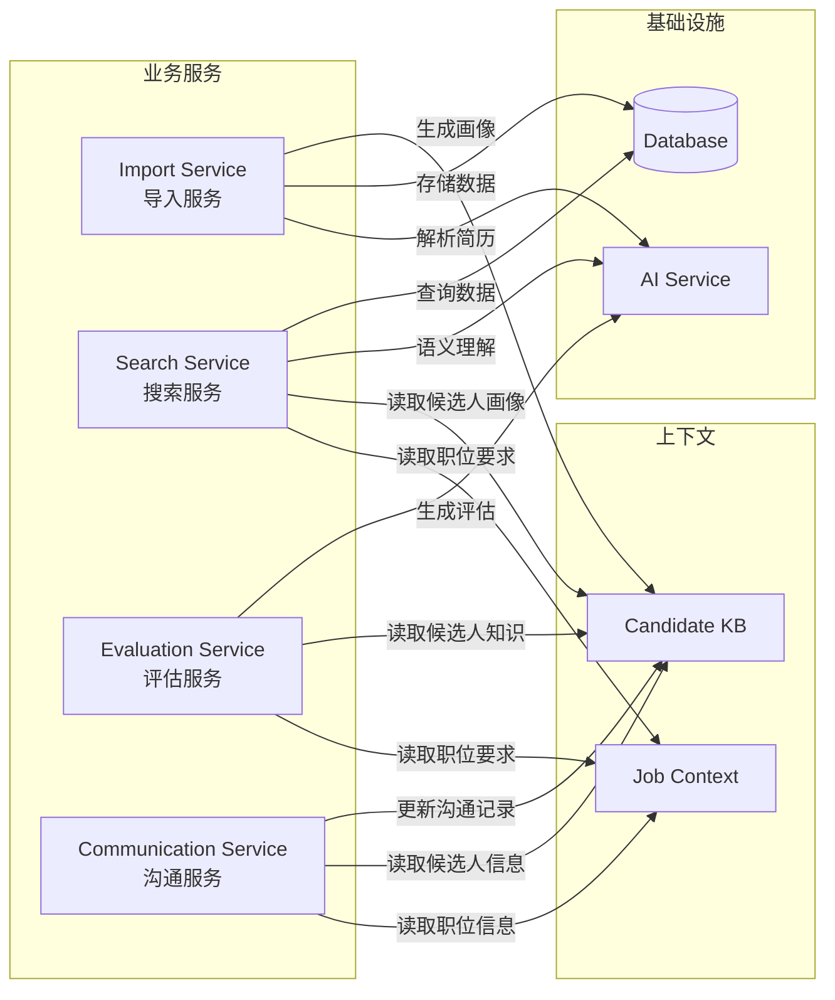
```mermaid
flowchart LR
    subgraph Services["业务服务"]
        IS[Import Service<br/>导入服务]
        SS[Search Service<br/>搜索服务]
        ES[Evaluation Service<br/>评估服务]
        CS[Communication Service<br/>沟通服务]
    end

    subgraph Context["上下文"]
        JC[Job Context]
        CKB[Candidate KB]
    end

    subgraph Infra["基础设施"]
        AI[AI Service]
        DB[(Database)]
    end

    %% Import Service 依赖
    IS -->|"解析简历"| AI
    IS -->|"存储数据"| DB
    IS -->|"生成画像"| CKB

    %% Search Service 依赖
    SS -->|"读取职位要求"| JC
    SS -->|"读取候选人画像"| CKB
    SS -->|"语义理解"| AI
    SS -->|"查询数据"| DB

    %% Evaluation Service 依赖
    ES -->|"读取职位要求"| JC
    ES -->|"读取候选人知识"| CKB
    ES -->|"生成评估"| AI

    %% Communication Service 依赖
    CS -->|"读取职位信息"| JC
    CS -->|"读取候选人信息"| CKB
    CS -->|"更新沟通记录"| CKB
```

### 3.2 服务接口矩阵

| 服务 | 对外接口 | 依赖的上下文 | 依赖的基础设施 |
|------|----------|--------------|----------------|
| Import Service | `import_resume`, `batch_import` | CKB (写) | AI, DB, Storage |
| Search Service | `search`, `refine`, `similar` | JC (读), CKB (读) | AI, DB |
| Evaluation Service | `analyze`, `compare`, `match` | JC (读), CKB (读写) | AI |
| Communication Service | `outreach`, `record_contact` | JC (读), CKB (读写) | - |

---

## 四、搜索流程架构

### 4.1 搜索流程时序图

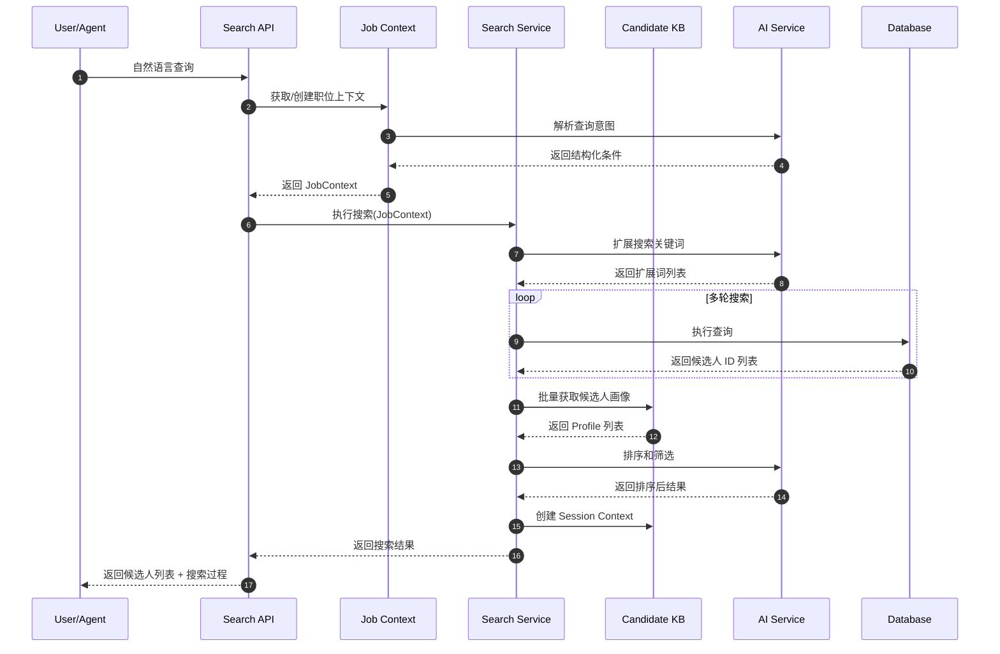
```mermaid
sequenceDiagram
    autonumber
    participant U as User/Agent
    participant API as Search API
    participant JC as Job Context
    participant SS as Search Service
    participant CKB as Candidate KB
    participant AI as AI Service
    participant DB as Database

    U->>API: 自然语言查询
    API->>JC: 获取/创建职位上下文
    JC->>AI: 解析查询意图
    AI-->>JC: 返回结构化条件
    JC-->>API: 返回 JobContext

    API->>SS: 执行搜索(JobContext)
    SS->>AI: 扩展搜索关键词
    AI-->>SS: 返回扩展词列表

    loop 多轮搜索
        SS->>DB: 执行查询
        DB-->>SS: 返回候选人 ID 列表
    end

    SS->>CKB: 批量获取候选人画像
    CKB-->>SS: 返回 Profile 列表

    SS->>AI: 排序和筛选
    AI-->>SS: 返回排序后结果

    SS->>CKB: 创建 Session Context
    SS-->>API: 返回搜索结果
    API-->>U: 返回候选人列表 + 搜索过程
```

### 4.2 搜索模块内部架构

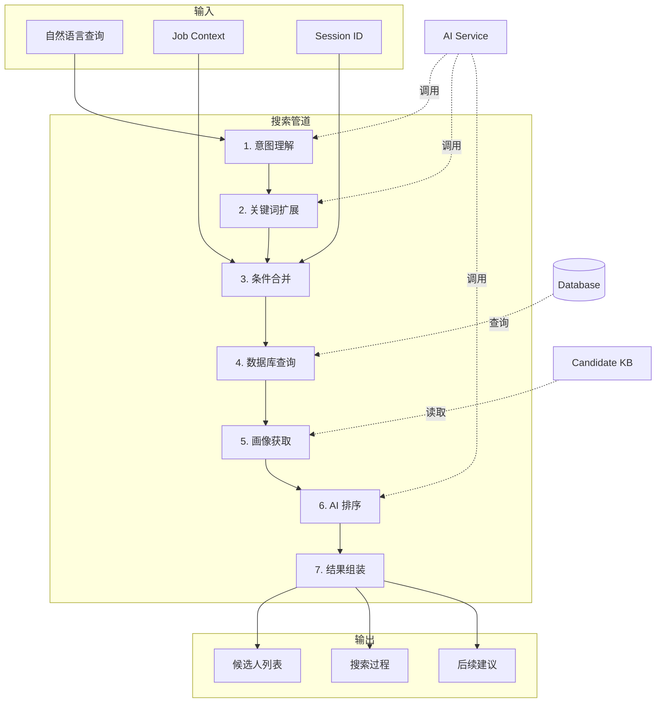
```mermaid
flowchart TB
    subgraph Input["输入"]
        Q[自然语言查询]
        JC[Job Context]
        Session[Session ID]
    end

    subgraph Pipeline["搜索管道"]
        direction TB
        P1[1. 意图理解]
        P2[2. 关键词扩展]
        P3[3. 条件合并]
        P4[4. 数据库查询]
        P5[5. 画像获取]
        P6[6. AI 排序]
        P7[7. 结果组装]

        P1 --> P2 --> P3 --> P4 --> P5 --> P6 --> P7
    end

    subgraph Output["输出"]
        R1[候选人列表]
        R2[搜索过程]
        R3[后续建议]
    end

    Q --> P1
    JC --> P3
    Session --> P3
    P7 --> R1
    P7 --> R2
    P7 --> R3

    %% 外部依赖
    AI[AI Service] -.->|"调用"| P1
    AI -.->|"调用"| P2
    AI -.->|"调用"| P6
    DB[(Database)] -.->|"查询"| P4
    CKB[Candidate KB] -.->|"读取"| P5
```

---

## 五、数据流架构

### 5.1 简历导入数据流

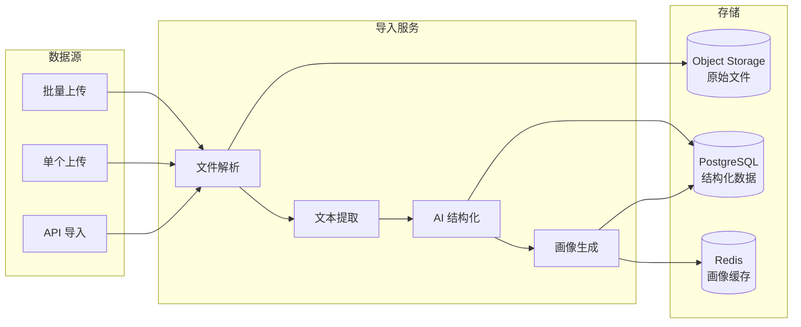
```mermaid
flowchart LR
    subgraph Sources["数据源"]
        F1[批量上传]
        F2[单个上传]
        F3[API 导入]
    end

    subgraph Import["导入服务"]
        I1[文件解析]
        I2[文本提取]
        I3[AI 结构化]
        I4[画像生成]
    end

    subgraph Storage["存储"]
        S1[(Object Storage<br/>原始文件)]
        S2[(PostgreSQL<br/>结构化数据)]
        S3[(Redis<br/>画像缓存)]
    end

    F1 --> I1
    F2 --> I1
    F3 --> I1

    I1 --> S1
    I1 --> I2
    I2 --> I3
    I3 --> S2
    I3 --> I4
    I4 --> S2
    I4 --> S3
```

### 5.2 搜索数据流

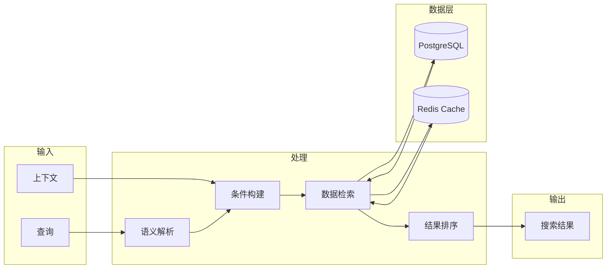
```mermaid
flowchart LR
    subgraph Input["输入"]
        Q[查询]
        C[上下文]
    end

    subgraph Process["处理"]
        P1[语义解析]
        P2[条件构建]
        P3[数据检索]
        P4[结果排序]
    end

    subgraph Data["数据层"]
        D1[(PostgreSQL)]
        D2[(Redis Cache)]
    end

    subgraph Output["输出"]
        R[搜索结果]
    end

    Q --> P1
    C --> P2
    P1 --> P2
    P2 --> P3
    P3 --> D1
    D1 --> P3
    P3 --> D2
    D2 --> P3
    P3 --> P4
    P4 --> R
```

---

## 六、API 层次架构

### 6.1 三层 API 设计

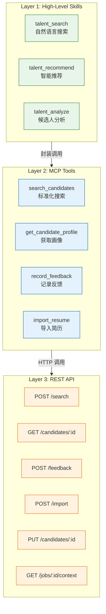
```mermaid
flowchart TB
    subgraph L1["Layer 1: High-Level Skills"]
        S1["talent_search<br/>自然语言搜索"]
        S2["talent_recommend<br/>智能推荐"]
        S3["talent_analyze<br/>候选人分析"]
    end

    subgraph L2["Layer 2: MCP Tools"]
        M1["search_candidates<br/>标准化搜索"]
        M2["get_candidate_profile<br/>获取画像"]
        M3["record_feedback<br/>记录反馈"]
        M4["import_resume<br/>导入简历"]
    end

    subgraph L3["Layer 3: REST API"]
        R1["POST /search"]
        R2["GET /candidates/:id"]
        R3["POST /feedback"]
        R4["POST /import"]
        R5["PUT /candidates/:id"]
        R6["GET /jobs/:id/context"]
    end

    L1 -->|"封装调用"| L2
    L2 -->|"HTTP 调用"| L3

    classDef skill fill:#e8f5e9,stroke:#2e7d32
    classDef mcp fill:#e3f2fd,stroke:#1565c0
    classDef rest fill:#fff3e0,stroke:#ef6c00

    class S1,S2,S3 skill
    class M1,M2,M3,M4 mcp
    class R1,R2,R3,R4,R5,R6 rest
```

### 6.2 API 层次对比

| 层次 | 抽象程度 | 灵活性 | 适用场景 | 调用方 |
|------|----------|--------|----------|--------|
| Skills | 高 | 低 | 标准场景，快速接入 | 特定 Agent 框架 |
| MCP Tools | 中 | 中 | 跨框架兼容 | 任何支持 MCP 的 Agent |
| REST API | 低 | 高 | 复杂场景，自定义流程 | 任何 HTTP 客户端 |

---

## 七、Memory 架构

### 7.1 三层 Memory 模型

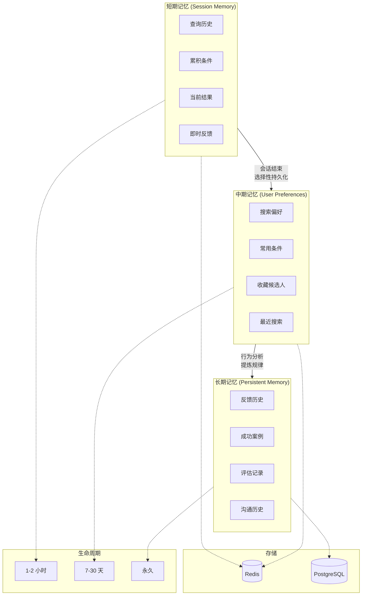
```mermaid
flowchart TB
    subgraph Short["短期记忆 (Session Memory)"]
        S1[查询历史]
        S2[累积条件]
        S3[当前结果]
        S4[即时反馈]
    end

    subgraph Medium["中期记忆 (User Preferences)"]
        M1[搜索偏好]
        M2[常用条件]
        M3[收藏候选人]
        M4[最近搜索]
    end

    subgraph Long["长期记忆 (Persistent Memory)"]
        L1[反馈历史]
        L2[成功案例]
        L3[评估记录]
        L4[沟通历史]
    end

    Short -->|"会话结束<br/>选择性持久化"| Medium
    Medium -->|"行为分析<br/>提炼规律"| Long

    subgraph Storage["存储"]
        Redis[(Redis)]
        PG[(PostgreSQL)]
    end

    Short -.-> Redis
    Medium -.-> Redis
    Long -.-> PG

    subgraph TTL["生命周期"]
        T1["1-2 小时"]
        T2["7-30 天"]
        T3["永久"]
    end

    Short -.-> T1
    Medium -.-> T2
    Long -.-> T3
```

### 7.2 Memory 数据模型

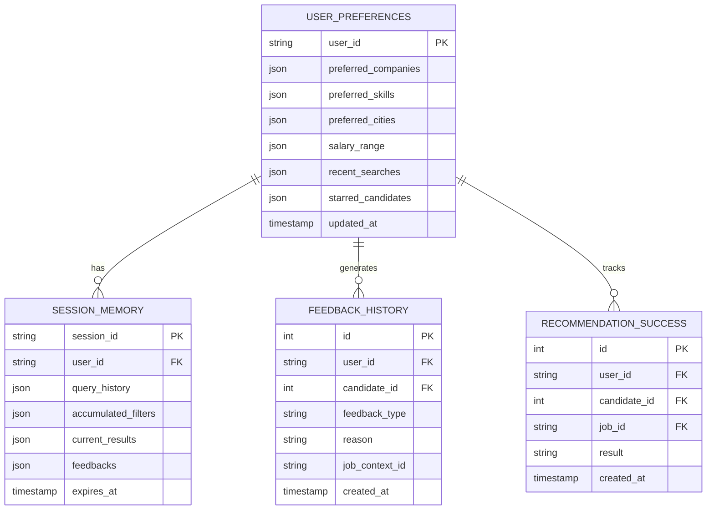
```mermaid
erDiagram
    SESSION_MEMORY {
        string session_id PK
        string user_id FK
        json query_history
        json accumulated_filters
        json current_results
        json feedbacks
        timestamp expires_at
    }

    USER_PREFERENCES {
        string user_id PK
        json preferred_companies
        json preferred_skills
        json preferred_cities
        json salary_range
        json recent_searches
        json starred_candidates
        timestamp updated_at
    }

    FEEDBACK_HISTORY {
        int id PK
        string user_id FK
        int candidate_id FK
        string feedback_type
        string reason
        string job_context_id
        timestamp created_at
    }

    RECOMMENDATION_SUCCESS {
        int id PK
        string user_id FK
        int candidate_id FK
        string job_id FK
        string result
        timestamp created_at
    }

    USER_PREFERENCES ||--o{ SESSION_MEMORY : "has"
    USER_PREFERENCES ||--o{ FEEDBACK_HISTORY : "generates"
    USER_PREFERENCES ||--o{ RECOMMENDATION_SUCCESS : "tracks"
```

---

## 八、部署架构

### 8.1 容器化部署

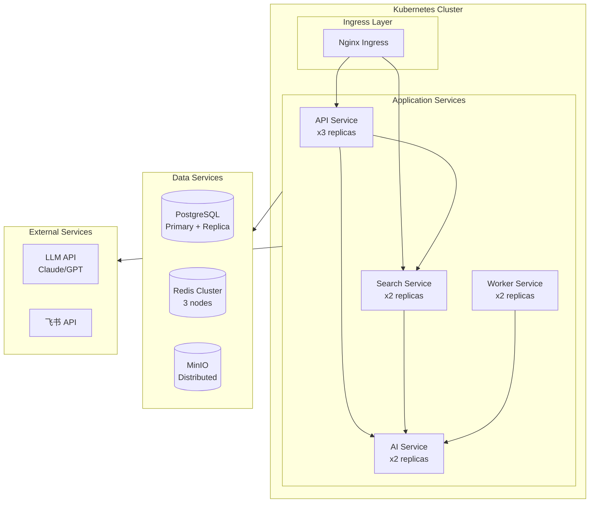
```mermaid
flowchart TB
    subgraph K8S["Kubernetes Cluster"]
        subgraph Ingress["Ingress Layer"]
            IG[Nginx Ingress]
        end

        subgraph App["Application Services"]
            API[API Service<br/>x3 replicas]
            Search[Search Service<br/>x2 replicas]
            AI_SVC[AI Service<br/>x2 replicas]
            Worker[Worker Service<br/>x2 replicas]
        end

        IG --> API
        IG --> Search
        API --> Search
        API --> AI_SVC
        Search --> AI_SVC
        Worker --> AI_SVC
    end

    subgraph Data["Data Services"]
        PG[(PostgreSQL<br/>Primary + Replica)]
        Redis[(Redis Cluster<br/>3 nodes)]
        MinIO[(MinIO<br/>Distributed)]
    end

    subgraph External["External Services"]
        LLM[LLM API<br/>Claude/GPT]
        Feishu[飞书 API]
    end

    App --> Data
    App --> External
```

### 8.2 服务依赖矩阵

| 服务 | 依赖服务 | 依赖数据 | 外部依赖 |
|------|----------|----------|----------|
| API Service | Search, AI | PostgreSQL, Redis | - |
| Search Service | AI | PostgreSQL, Redis | - |
| AI Service | - | - | LLM API |
| Worker Service | AI | PostgreSQL, MinIO | - |

---

## 九、模块依赖图

### 9.1 完整依赖关系

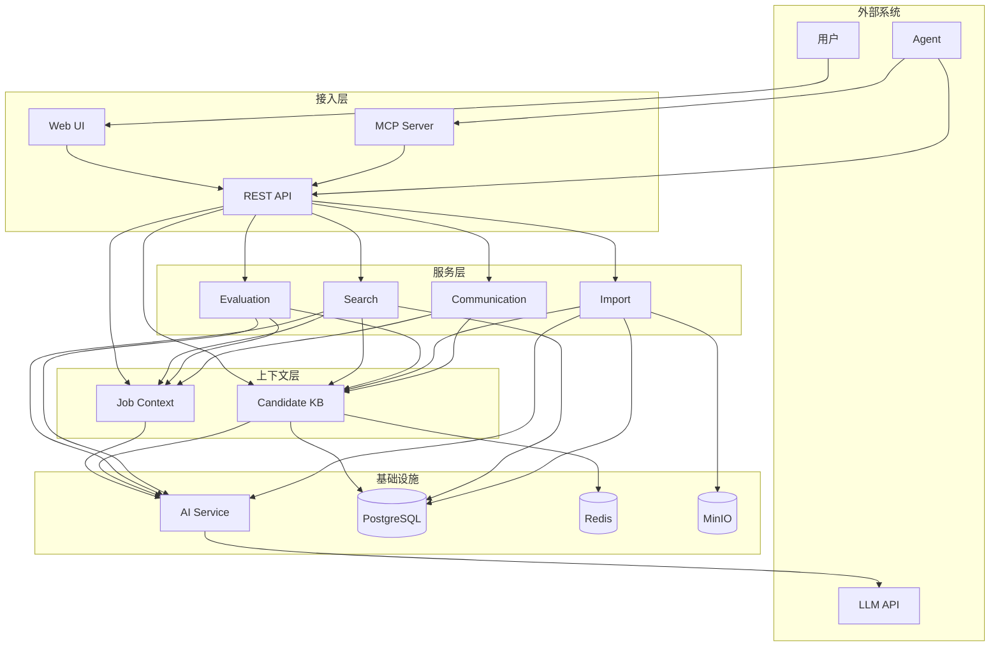
```mermaid
flowchart TB
    subgraph External["外部系统"]
        User[用户]
        Agent[Agent]
        LLM[LLM API]
    end

    subgraph Access["接入层"]
        Web[Web UI]
        MCP[MCP Server]
        REST[REST API]
    end

    subgraph Context["上下文层"]
        JC[Job Context]
        CKB[Candidate KB]
    end

    subgraph Service["服务层"]
        SS[Search]
        ES[Evaluation]
        IS[Import]
        CS[Communication]
    end

    subgraph Infra["基础设施"]
        AI[AI Service]
        DB[(PostgreSQL)]
        Cache[(Redis)]
        Storage[(MinIO)]
    end

    %% 外部依赖
    User --> Web
    Agent --> MCP
    Agent --> REST

    %% 接入层依赖
    Web --> REST
    MCP --> REST
    REST --> JC
    REST --> CKB
    REST --> SS
    REST --> ES
    REST --> IS
    REST --> CS

    %% 上下文层依赖
    JC --> AI
    CKB --> AI
    CKB --> DB
    CKB --> Cache

    %% 服务层依赖
    SS --> JC
    SS --> CKB
    SS --> AI
    SS --> DB

    ES --> JC
    ES --> CKB
    ES --> AI

    IS --> CKB
    IS --> AI
    IS --> DB
    IS --> Storage

    CS --> JC
    CS --> CKB

    %% AI 服务外部依赖
    AI --> LLM
```

### 9.2 依赖规则

1. **禁止循环依赖**: A→B→C→A 形式的依赖链不允许存在
2. **按需走层，非强制全路径**: 根据操作复杂度选择最短有效路径
3. **上下文层可选**: 简单查询可跳过，复杂查询需要
4. **基础设施无业务逻辑**: L4 不包含业务逻辑，只提供能力

---

## 十、路由策略：按需走层

### 10.1 核心原则

**不是所有请求都必须走 L1→L2→L3→L4，而是根据操作复杂度选择最短有效路径。**

层的价值：
- **L2 上下文层**: 语义理解、意图解析、上下文管理
- **L3 服务层**: 业务逻辑、权限校验、结果组装
- **L4 基础设施**: 数据存储、AI 能力

如果某个操作不需要某层提供的价值，就不应该强制经过该层。

### 10.2 路由决策图

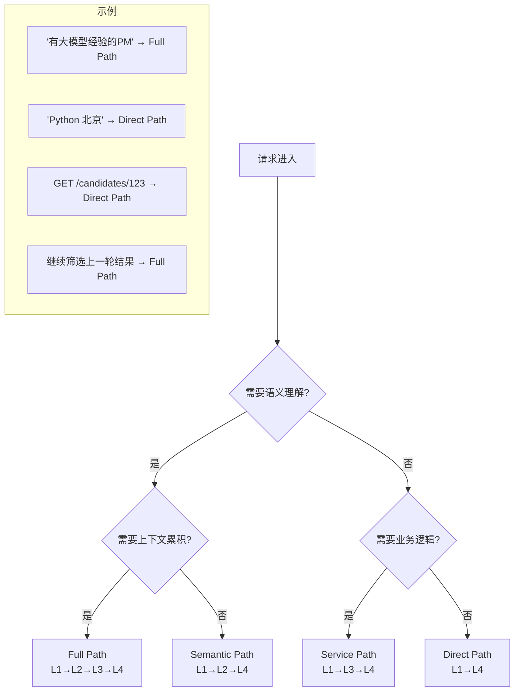
```mermaid
flowchart TB
    Start[请求进入] --> Q1{需要语义理解?}

    Q1 -->|是| Q2{需要上下文累积?}
    Q1 -->|否| Q3{需要业务逻辑?}

    Q2 -->|是| Full["Full Path<br/>L1→L2→L3→L4"]
    Q2 -->|否| Semantic["Semantic Path<br/>L1→L2→L4"]

    Q3 -->|是| Service["Service Path<br/>L1→L3→L4"]
    Q3 -->|否| Direct["Direct Path<br/>L1→L4"]

    subgraph Examples["示例"]
        E1["'有大模型经验的PM' → Full Path"]
        E2["'Python 北京' → Direct Path"]
        E3["GET /candidates/123 → Direct Path"]
        E4["继续筛选上一轮结果 → Full Path"]
    end
```

### 10.3 四种路由路径

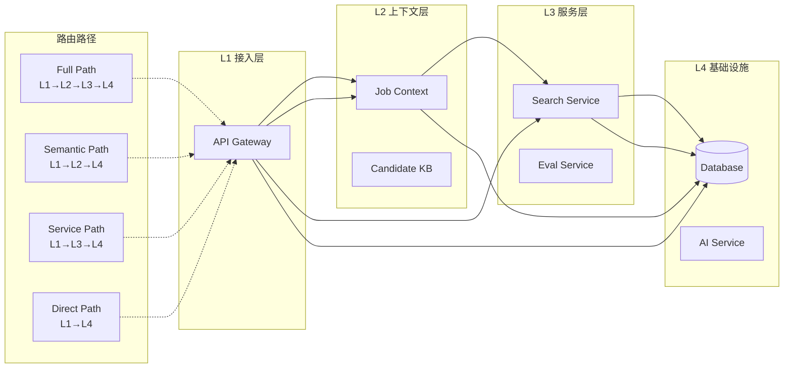
```mermaid
flowchart LR
    subgraph Paths["路由路径"]
        direction TB
        P1["Full Path<br/>L1→L2→L3→L4"]
        P2["Semantic Path<br/>L1→L2→L4"]
        P3["Service Path<br/>L1→L3→L4"]
        P4["Direct Path<br/>L1→L4"]
    end

    subgraph L1["L1 接入层"]
        API[API Gateway]
    end

    subgraph L2["L2 上下文层"]
        JC[Job Context]
        CKB[Candidate KB]
    end

    subgraph L3["L3 服务层"]
        SS[Search Service]
        ES[Eval Service]
    end

    subgraph L4["L4 基础设施"]
        DB[(Database)]
        AI[AI Service]
    end

    P1 -.-> API --> JC --> SS --> DB
    P2 -.-> API --> JC --> DB
    P3 -.-> API --> SS --> DB
    P4 -.-> API --> DB
```

### 10.4 路径选择矩阵

| 操作类型 | 路径 | 经过的层 | 原因 |
|----------|------|----------|------|
| 自然语言搜索 | Full | L1→L2→L3→L4 | 需要意图解析 + 关键词扩展 + 排序 |
| 多轮对话搜索 | Full | L1→L2→L3→L4 | 需要上下文累积 |
| 候选人评估 | Full | L1→L2→L3→L4 | 需要职位上下文 + AI 分析 |
| 简单关键词搜索 | Direct | L1→L4 | 关键词明确，直接匹配 |
| 精确字段查询 | Direct | L1→L4 | 已是结构化条件 |
| 获取候选人详情 | Direct | L1→L4 | 简单 ID 查询 |
| 批量导入简历 | Service | L1→L3→L4 | 需要业务逻辑，不需要搜索上下文 |
| 记录沟通反馈 | Service | L1→L3→L4 | 需要业务校验 |
| 语义相似搜索 | Semantic | L1→L2→L4 | 需要语义理解，不需要复杂业务逻辑 |

### 10.5 API 设计示例

```yaml
# Direct Path: 简单关键词搜索
POST /api/v1/search/keywords
  path: direct
  layers: [L1, L4]
  input:
    keywords: ["Python", "北京"]
    filters:
      min_experience: 3
  behavior: 直接构造 SQL 查询，不经过语义解析

# Full Path: 自然语言搜索
POST /api/v1/search/natural
  path: full
  layers: [L1, L2, L3, L4]
  input:
    query: "有大模型经验的产品经理，最好在北京"
    session_id: "xxx"  # 可选，用于多轮对话
  behavior:
    - L2 解析意图，扩展关键词
    - L3 执行多轮搜索，排序
    - L4 查询数据库

# Service Path: 批量导入
POST /api/v1/import/batch
  path: service
  layers: [L1, L3, L4]
  input:
    files: [...]
  behavior:
    - L3 处理文件解析、去重、校验
    - L4 存储数据、生成画像

# Direct Path: 获取详情
GET /api/v1/candidates/{id}
  path: direct
  layers: [L1, L4]
  behavior: 直接查询数据库返回
```

### 10.6 路由决策的实现

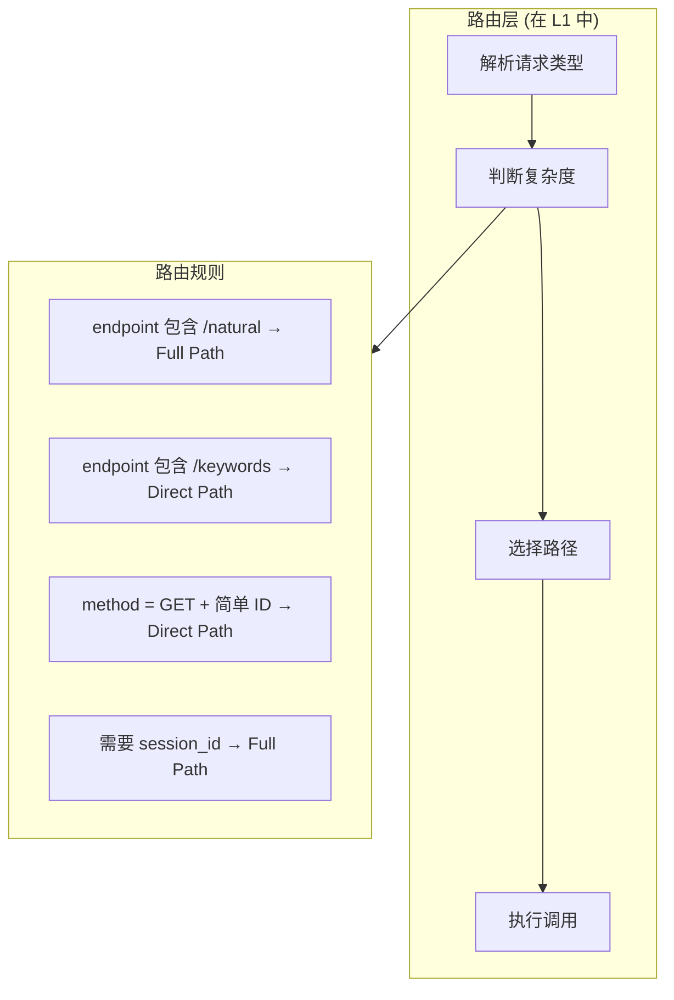
```mermaid
flowchart TB
    subgraph Router["路由层 (在 L1 中)"]
        R1[解析请求类型]
        R2[判断复杂度]
        R3[选择路径]
        R4[执行调用]

        R1 --> R2 --> R3 --> R4
    end

    subgraph Rules["路由规则"]
        Rule1["endpoint 包含 /natural → Full Path"]
        Rule2["endpoint 包含 /keywords → Direct Path"]
        Rule3["method = GET + 简单 ID → Direct Path"]
        Rule4["需要 session_id → Full Path"]
    end

    R2 --> Rules
```

### 10.7 跨层调用的权限控制

虽然允许跨层调用，但仍需权限控制：

| 路径 | 默认权限 | 说明 |
|------|----------|------|
| Full Path | 所有用户 | 标准路径，完整功能 |
| Service Path | 所有用户 | 跳过上下文，但有业务校验 |
| Semantic Path | 所有用户 | 跳过服务层，但有语义理解 |
| Direct Path | 需声明 | 跳过上下文和服务，需要说明原因 |
| Raw SQL | 仅 Admin | 直接操作数据库，审计记录 |

### 10.8 为什么这样设计

| 设计决策 | 理由 |
|----------|------|
| **按需走层** | 避免简单操作的性能开销 |
| **路径可选** | 给 Agent 灵活性，不强制走固定流程 |
| **保留完整路径** | 复杂操作仍然需要完整的语义理解和业务逻辑 |
| **权限控制** | 灵活不等于无序，仍需要审计和控制 |

---

## 十一、错误处理与容错

### 11.1 错误传播链

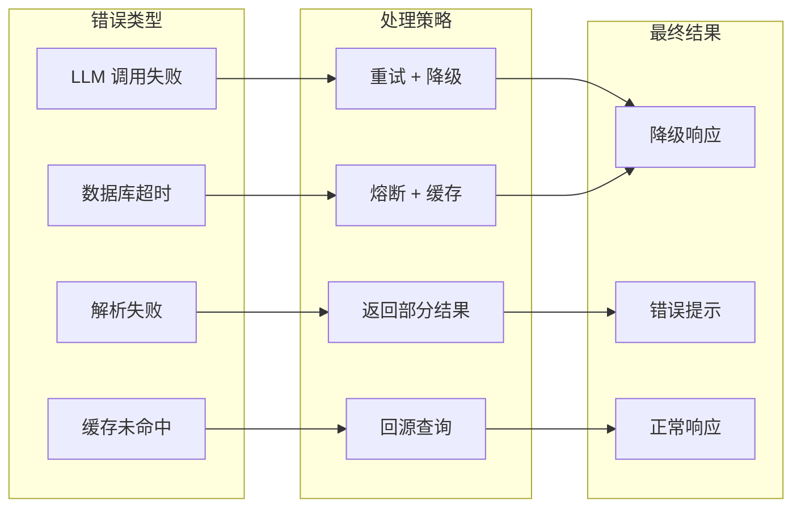
```mermaid
flowchart LR
    subgraph Errors["错误类型"]
        E1[LLM 调用失败]
        E2[数据库超时]
        E3[缓存未命中]
        E4[解析失败]
    end

    subgraph Handling["处理策略"]
        H1[重试 + 降级]
        H2[熔断 + 缓存]
        H3[回源查询]
        H4[返回部分结果]
    end

    subgraph Result["最终结果"]
        R1[降级响应]
        R2[错误提示]
        R3[正常响应]
    end

    E1 --> H1
    E2 --> H2
    E3 --> H3
    E4 --> H4

    H1 --> R1
    H2 --> R1
    H3 --> R3
    H4 --> R2
```

### 11.2 容错设计

| 故障场景 | 检测方式 | 处理策略 | 恢复时间 |
|----------|----------|----------|----------|
| LLM 不可用 | 超时/错误码 | 使用缓存结果/简单规则 | 自动恢复 |
| 数据库主库故障 | 健康检查 | 切换到从库 | < 30s |
| Redis 故障 | 连接失败 | 回源数据库 | 自动恢复 |
| 搜索超时 | 超时设置 | 返回部分结果 | 即时 |

---

## 十二、工程挑战与解决方案

本节描述系统设计中的关键工程挑战及其解决方案架构。

### 12.1 挑战一：私有库加密 vs AI 语义处理

#### 12.1.1 问题描述

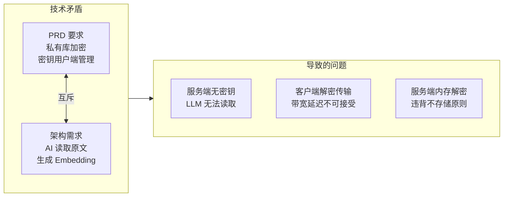
```mermaid
flowchart LR
    subgraph Contradiction["技术矛盾"]
        direction TB
        R1["PRD 要求<br/>私有库加密<br/>密钥用户端管理"]
        R2["架构需求<br/>AI 读取原文<br/>生成 Embedding"]

        R1 <-->|"互斥"| R2
    end

    subgraph Problems["导致的问题"]
        P1["服务端无密钥<br/>LLM 无法读取"]
        P2["客户端解密传输<br/>带宽延迟不可接受"]
        P3["服务端内存解密<br/>违背不存储原则"]
    end

    Contradiction --> Problems
```

#### 12.1.2 解决方案：KMS + 租户隔离

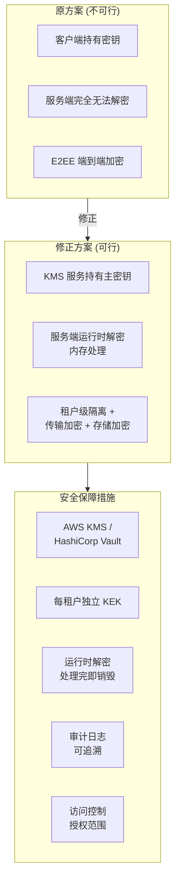
```mermaid
flowchart TB
    subgraph OldDesign["原方案 (不可行)"]
        O1[客户端持有密钥]
        O2[服务端完全无法解密]
        O3[E2EE 端到端加密]
    end

    subgraph NewDesign["修正方案 (可行)"]
        N1[KMS 服务持有主密钥]
        N2[服务端运行时解密<br/>内存处理]
        N3[租户级隔离 +<br/>传输加密 + 存储加密]
    end

    OldDesign -->|"修正"| NewDesign

    subgraph Security["安全保障措施"]
        S1["AWS KMS /<br/>HashiCorp Vault"]
        S2["每租户独立 KEK"]
        S3["运行时解密<br/>处理完即销毁"]
        S4["审计日志<br/>可追溯"]
        S5["访问控制<br/>授权范围"]
    end

    NewDesign --> Security
```

#### 12.1.3 数据处理流程

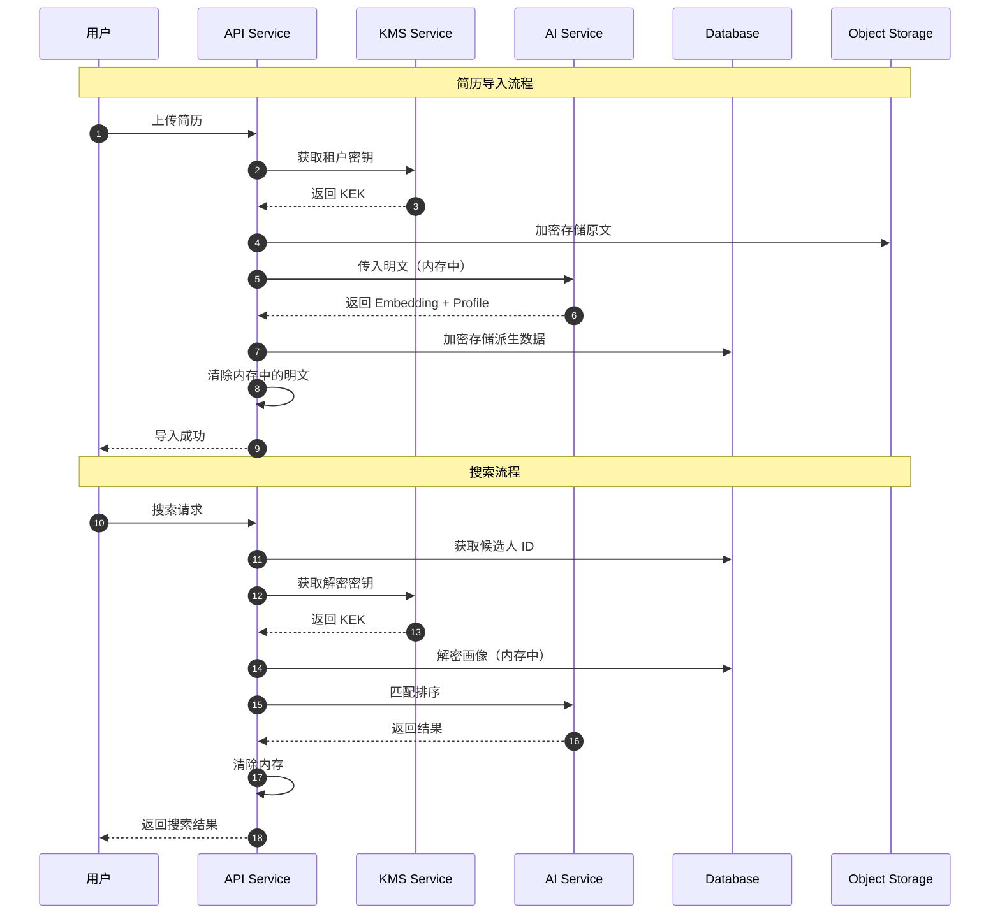
```mermaid
sequenceDiagram
    autonumber
    participant U as 用户
    participant API as API Service
    participant KMS as KMS Service
    participant AI as AI Service
    participant DB as Database
    participant Storage as Object Storage

    Note over U,Storage: 简历导入流程
    U->>API: 上传简历
    API->>KMS: 获取租户密钥
    KMS-->>API: 返回 KEK
    API->>Storage: 加密存储原文
    API->>AI: 传入明文（内存中）
    AI-->>API: 返回 Embedding + Profile
    API->>DB: 加密存储派生数据
    API->>API: 清除内存中的明文
    API-->>U: 导入成功

    Note over U,Storage: 搜索流程
    U->>API: 搜索请求
    API->>DB: 获取候选人 ID
    API->>KMS: 获取解密密钥
    KMS-->>API: 返回 KEK
    API->>DB: 解密画像（内存中）
    API->>AI: 匹配排序
    AI-->>API: 返回结果
    API->>API: 清除内存
    API-->>U: 返回搜索结果
```

### 12.2 挑战二：Full Path 延迟优化

#### 12.2.1 问题描述

```mermaid
gantt
    title Full Path 串行调用链（原方案）
    dateFormat X
    axisFormat %s秒

    section LLM 调用
    解析意图        :a1, 0, 2
    扩展关键词      :a2, after a1, 2

    section 数据操作
    数据库查询      :a3, after a2, 1
    批量获取画像    :a4, after a3, 1

    section LLM 调用
    AI 排序筛选     :a5, after a4, 3
    生成解释        :a6, after a5, 2

    section 总计
    总延迟 10-15秒  :milestone, after a6, 0
```

#### 12.2.2 解决方案：流式输出 + 并行优化

```mermaid
flowchart TB
    subgraph Traditional["传统方案（串行阻塞）"]
        T1["用户等待 15s"] --> T2["收到完整结果"]
    end

    subgraph Streaming["优化方案（流式非阻塞）"]
        direction TB
        S1["0.5s: 正在解析需求..."]
        S2["2s: 正在扩展关键词..."]
        S3["3s: 找到 50 个初步匹配<br/>显示前 5 个未排序结果"]
        S4["5s: 正在智能排序...<br/>逐个更新排序"]
        S5["7s: 完成<br/>共 12 个高匹配候选人"]

        S1 --> S2 --> S3 --> S4 --> S5
    end

    Traditional -->|"用户体验：干等 15s"| Bad[体验差]
    Streaming -->|"用户体验：3s 看到内容"| Good[体验好]
```

#### 12.2.3 并行优化架构

```mermaid
flowchart TB
    subgraph Serial["原串行流程"]
        direction LR
        P1[解析意图] --> P2[扩展关键词] --> P3[查询] --> P4[画像] --> P5[排序] --> P6[解释]
    end

    subgraph Parallel["优化后并行流程"]
        direction TB

        subgraph Phase1["Phase 1: 并行解析"]
            PA[解析意图]
            PB[扩展关键词]
        end

        subgraph Phase2["Phase 2: 渐进查询"]
            PC[初步查询<br/>用初步条件]
            PD[返回初步结果<br/>SSE 推送]
            PE[补充查询<br/>用扩展词]
        end

        subgraph Phase3["Phase 3: 并行处理"]
            PF[画像获取]
            PG[AI 排序<br/>流式]
            PH[解释生成<br/>异步/后置]
        end

        PA --> PC
        PB --> PE
        PC --> PD
        PE --> PD
        PD --> PF
        PF --> PG
        PF --> PH
    end

    Serial -->|"优化"| Parallel
```

#### 12.2.4 SSE 流式响应设计

```mermaid
sequenceDiagram
    autonumber
    participant C as Client
    participant API as Search API
    participant AI as AI Service
    participant DB as Database

    C->>API: POST /search/natural/stream

    API-->>C: event: status<br/>{"stage": "parsing", "message": "正在解析需求..."}

    API->>AI: 解析意图（并行）
    API->>AI: 扩展关键词（并行）

    API-->>C: event: status<br/>{"stage": "searching", "message": "正在搜索数据库..."}

    API->>DB: 执行查询
    DB-->>API: 返回结果

    API-->>C: event: partial_result<br/>{"candidates": [...前5个], "is_ranked": false, "more_coming": true}

    API->>AI: AI 排序

    API-->>C: event: partial_result<br/>{"candidates": [...更新排序后], "is_ranked": true, "more_coming": false}

    API-->>C: event: final_result<br/>{"candidates": [...], "search_process": [...], "reasoning": "..."}
```

### 12.3 挑战三：CKB 层级数据冲突

#### 12.3.1 冲突场景

```mermaid
flowchart TB
    subgraph Scenario["冲突场景示例"]
        L1["Layer 1 (Source)<br/>简历原文：熟悉高并发系统"]
        L2["Layer 2 (Profile)<br/>AI 推断：具备高并发经验<br/>标签：[高并发, 分布式]"]
        L3["Layer 3 (Knowledge)<br/>猎头备注：高并发是吹牛的<br/>只有 CRUD 经验"]
    end

    subgraph Question["Agent 搜索「高并发工程师」"]
        Q1["听 Layer 2？<br/>→ 推荐此人（错误）"]
        Q2["听 Layer 3？<br/>→ 不推荐（正确）"]
    end

    L1 --> L2 --> L3
    L2 --> Q1
    L3 --> Q2

    Q2 -->|"应该"| Correct["正确决策"]
```

#### 12.3.2 层级优先级规则

```mermaid
flowchart TB
    subgraph Priority["优先级（高 → 低）"]
        direction TB
        P1["🥇 Layer 3 (Knowledge)<br/>人类显式修正<br/>权重：最高<br/>可直接覆写 Layer 2"]
        P2["🥈 Layer 1 (Source)<br/>原始事实<br/>权重：高<br/>是事实基础"]
        P3["🥉 Layer 2 (Profile)<br/>AI 推断<br/>权重：最低<br/>可被 Layer 3 覆写"]

        P1 --> P2 --> P3
    end

    subgraph Examples["具体权重"]
        E1["human_verified → boost 1.5"]
        E2["resume 原文 → boost 1.0"]
        E3["ai_inferred (high) → boost 0.8"]
        E4["ai_inferred (low) → boost 0.5"]
        E5["human_denied → 排除"]
    end

    Priority --> Examples
```

#### 12.3.3 冲突处理流程

```mermaid
flowchart TB
    Start["搜索匹配技能"] --> Find{"找到技能条目?"}

    Find -->|否| NoMatch["不匹配"]
    Find -->|是| CheckSource{"检查 source"}

    CheckSource -->|human_denied| Exclude["排除候选人"]
    CheckSource -->|human_verified| HighBoost["匹配 + 加权 1.5"]
    CheckSource -->|resume| NormalBoost["匹配 + 正常权重 1.0"]
    CheckSource -->|ai_inferred| CheckConf{"检查 confidence"}

    CheckConf -->|high| MediumBoost["匹配 + 降权 0.8"]
    CheckConf -->|medium/low| LowBoost["匹配 + 降权 0.5"]
```

#### 12.3.4 反馈校准机制

```mermaid
sequenceDiagram
    autonumber
    participant HR as 猎头/HR
    participant API as API Service
    participant L3 as Layer 3<br/>Knowledge
    participant L2 as Layer 2<br/>Profile
    participant DB as Database

    HR->>API: 标记"候选人 X 的高并发经验是假的"

    API->>L3: 记录反馈
    Note over L3: 写入 interview_feedback

    API->>L2: 更新 skills_with_confidence
    Note over L2: "高并发".source = 'human_denied'

    API->>DB: 记录冲突
    Note over DB: conflicts: {<br/>  layer2: "高并发经验",<br/>  layer3: "无真实经验",<br/>  resolution: "layer3_wins"<br/>}

    API-->>HR: 更新成功

    Note over HR,DB: 下次搜索时
    HR->>API: 搜索"高并发工程师"
    API->>L2: 检查技能
    L2-->>API: source = 'human_denied'
    API-->>HR: 该候选人不在结果中

    opt 可选：触发画像重生成
        API->>L2: 重新生成 Profile
        Note over L2: 移除"高并发"标签
    end
```

#### 12.3.5 UI 冲突提示

```mermaid
flowchart LR
    subgraph Card["搜索结果卡片"]
        Name["张三 - 后端工程师 @ 某公司"]

        subgraph Skills["技能"]
            S1["Java ✓"]
            S2["分布式 ✓"]
            S3["高并发 ⚠️"]
        end

        Warning["⚠️ 面试反馈：经验存疑"]

        Actions["[查看详情] [对比] [联系]"]
    end

    S3 --> Warning
```

---

## 附录

### A. Mermaid 图例说明

| 形状 | 含义 |
|------|------|
| `[方框]` | 服务/模块 |
| `[(圆柱)]` | 数据库 |
| `{菱形}` | 决策点 |
| `-->` | 依赖/调用 |
| `-.->` | 弱依赖/可选 |

### B. 颜色编码

| 颜色 | 含义 |
|------|------|
| 蓝色 (#e3f2fd) | Agent 相关 |
| 绿色 (#e8f5e9) | 服务层 |
| 橙色 (#fff3e0) | 上下文层 |
| 粉色 (#fce4ec) | 基础设施 |

### C. 版本历史

| 版本 | 日期 | 变更说明 |
|------|------|----------|
| v1.0 | 2024-01 | 初始版本，ASCII 图表 |
| v2.0 | 2024-02 | 重构为 Mermaid，增加候选人知识库架构 |
| v2.1 | 2024-02 | 改为按需走层的灵活路由，新增第十章路由策略 |
| v2.2 | 2024-02 | 与 agent-talent-search-design.md 同步，完善文档引用 |
| v2.3 | 2024-02 | 新增第十二章工程挑战：加密方案、延迟优化、层级冲突处理 |
